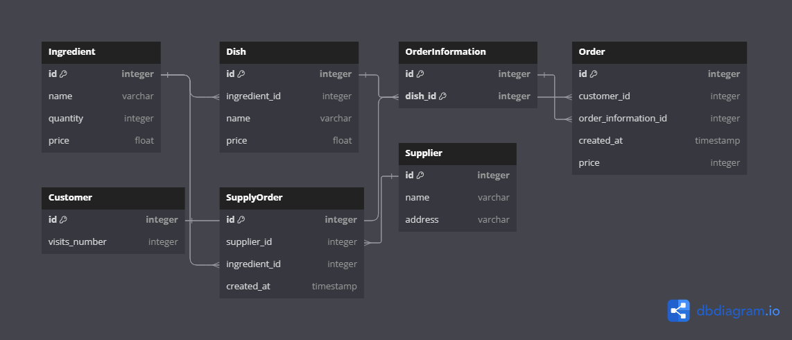

# restaurant_management
#### Project for class "Selected Topics in DBMS" - Restaurant system

This is a simple web application prepared for the assignment. It is created for educational purposes to learn about topics like normalization and database management systems, etc.

The app consists of 2 main parts:
- forms for creating: dishes, orders, supply orders
- reports for retrieving data from db in a specific format

To run the application firstly install dependencies:

```bash
pip install requirements.txt
```

Change configuration (create .flaskenv file) e.g.:
```bash
FLASK_APP=dbsm.py
SECRET_KEY=11111222222aaaaabbbbbccccdddd
SQLALCHEMY_DATABASE_URI=sqlite:///app.db
```

To run the application in development mode run this command:

```bash
flask run --debug
```

Go to `http://127.0.0.1:5000` to see the main page.

#### Simplified overview using Use case diagram, ER diagram, relations 




> Disclaimer: The diagrams do not take into account all many-to-many relations. For specifics go to app/models.py where all the relations are stored.

The default database is `sqlite`. To change it use different connection string in the environmental variables. You can use the postgresql and pgadmin for DBMS (look into docker-compose.yml file).

> REMEMBER to change the secret key and the WSGI server in the production environment

#### Functional software requirements created for this application

> Not all requirements were necessary to implement in this app

1. The system should gather and maintain data about sales of items, prices of items,
status of the inventory

     a) Keeping track of the inventory: When any ingredients are used, the quantity that
    was used has to be entered into system so that the system has the up-to-date state
    of the inventory. Input: ingredient, quantity, Output: changed information

     b) Automatic ordering: If the stock for any ingredient falls below a certain threshold,
    the system should generate automatically purchase orders for those products. The
    system should also guarantee that there is a minimum of two days stock at all times.
    Output: Purchase orders

     c) Calculating the threshold for ordering: The threshold used for ordering products
    that the restaurant is running out of, should be calculated based on average
    consumption of this ingredient for the past three days. Output: Calculated
    threshold.

2. Interaction with the system.

     a) The manager should have the ability to interact with the inventory saved in the
    system and data mentioned in point 1. The manager must have the ability to add or delete
    items and change prices of specific items. Input: Selected inventory to view or modify,
    Output: Modified data.

     b) When any transaction occurs the sales clerk should have the ability to scan or enter
    the code of the product and the quantity that was sold into the system. This transaction
    has to be saved and maintained by the system. After the ordering of any food the system
    should generate bills. Input: Code of the product. Output: Generated bills for that
    product.

The classes were accumulated in 4 weeks (more time = better app :))